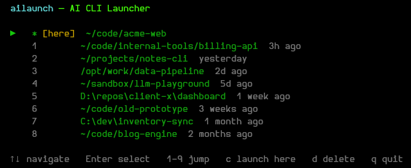

# ailaunch

ailaunch remembers the directories you've launched AI CLIs from, so you don't have to `cd` around or hunt for that project you were in last week. AI tooling is showing up in every project, and the list piles up fast — launch Claude Code through ailaunch once, and next time it shows you what you worked on and when.



## Installation

```
pip install ailaunch
```

## Usage

```
ailaunch [-- <claude args>]
```

Anything after `--` is forwarded directly to the underlying CLI process.

## Picker controls

| Key | Action |
|-----|--------|
| Up / Down | Navigate the list |
| Enter | Launch in the selected directory |
| c | Launch in the current directory immediately |
| 1-9 | Jump to and launch a numbered entry |
| d | Delete the selected entry from history |
| Home / End | Jump to first or last entry |
| q / Esc | Quit without launching |
